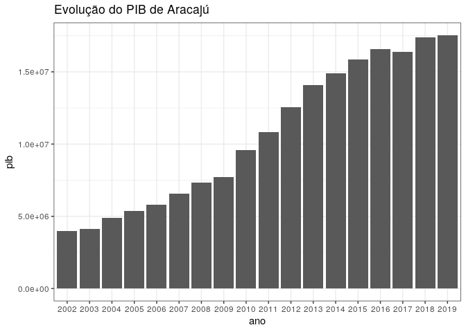
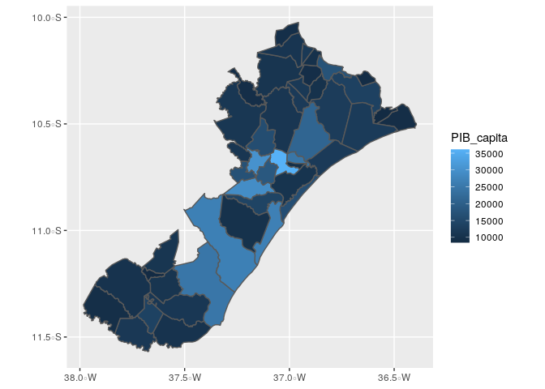
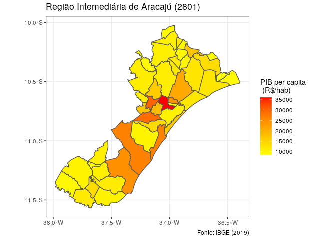

-   site: <https://github.com/Joaobazzo/oficina_rmarkdown>

-   pdf do manual:
    <https://github.com/Joaobazzo/oficina_rmarkdown/blob/main/README.pdf>

# Introdução

Esse relatório tem o objetivo de mostrar os dados socioeconômicos da
cidade de Aracaju, utilizando a estrutura de Rmarkdown. Markdown é uma
estrutura simples de formatação de relatórios, permitindo exportar
documentos em formatos HTML, PDF and MS Word. Para mais detalhes sobre
Rmarkdown, consultar <http://rmarkdown.rstudio.com>

Esse manual, assim como os dados estão disponíveis para download na
página <https://github.com/Joaobazzo/oficina_rmarkdown>.

Um importante manual para a criação de documentos em Rmarkdown está
disponível em:

-   R Markdown Cookbook <https://bookdown.org/yihui/rmarkdown-cookbook/>

Os requisitos de softwares para rodar esse exemplo são:

1.  R <https://cran.r-project.org/bin/windows/base/>

2.  RStudio Desktop Site:
    <https://www.rstudio.com/products/rstudio/download/#download>

3.  Latex Site: <https://www.latex-project.org/get/#tex-distributions>
    distribuição TexLive ou MikTek

Após a instalação dos softwares, instalar pacotes no R. Rodar no console
do RStudio os seguintes comandos:

    install.packages("ggplot2")
    install.packages("mapview")
    install.packages("geobr")
    install.packages("bookdown")
    install.packages("knitr")
    install.packages("rmarkdown")

Após a instalação, podemos incorporar os pacotes na memória do R.

    library(ggplot2)
    library(mapview)
    library(geobr)
    library(bookdown)
    library(knitr)
    library(rmarkdown)

A configuração inicial do documento em Rmarkdown deverá ser do seguinte
modo:

    ---
    title: "Relatório do município"
    author: "Seu nome"
    date: "`r Sys.Date()`"
    site: "https://github.com/Joaobazzo/oficina_rmarkdown"
    output: 
      bookdown::html_document2: default
    editor_options: 
      markdown: 
        wrap: 72
    ---

# Download e leitura de dados

Primeiro, nós precisamos incorporar os dados de análise em nosso
relatório. Nesse caso, nós vamos carregar os dados que já foram
pré-processados, através da função `load()`

    load(file = "data/cidades.RData")
    load(file = "data/pib_historico.RData")

Os dados de geometria especial, nós vamos baixar no IBGE através do
pacote `geobr`:

    geom_muni <- geobr::read_municipality(showProgress = FALSE)
    geom_rgint <- geobr::read_intermediate_region(showProgress = FALSE)

Verificando como os dados são apresentados, usando a função `head()`,
que carrega as primeiras duas linhas do arquivo.

    head(x = idh,n = 2)

    ##   code_muni name_muni code_state abbrev_state name_state name_region code_rgi
    ## 1   1400027   Amajari         14           RR    Roraima       Norte   140002
    ## 2   1400704  Uiramutã         14           RR    Roraima       Norte   140002
    ##    name_rgi code_intermediate name_intermediate mun_sudene mun_pisf mun_bsf
    ## 1 Pacaraima              1401         Boa Vista          0        0       0
    ## 2 Pacaraima              1401         Boa Vista          0        0       0
    ##   mun_bpar regiao_total semi_arido  idhm idhm_longevidade idhm_educacao
    ## 1        0            0          0 0.484            0.815         0.319
    ## 2        0            0          0 0.453            0.766         0.276
    ##   idhm_renda
    ## 1      0.437
    ## 2      0.439

    head(x = pib,n = 2)

    ##   code_muni             name_muni code_state abbrev_state name_state
    ## 1   1100015 Alta Floresta D'Oeste         11           RO   Rondônia
    ## 2   1100023             Ariquemes         11           RO   Rondônia
    ##   name_region code_rgi  name_rgi code_intermediate name_intermediate mun_sudene
    ## 1       Norte   110005    Cacoal              1102         Ji-Paraná          0
    ## 2       Norte   110002 Ariquemes              1101       Porto Velho          0
    ##   mun_pisf mun_bsf mun_bpar regiao_total semi_arido   VAB_Adm  VAB_Agro
    ## 1        0       0        0            0          0 155271000 165892000
    ## 2        0       0        0            0          0 674541000 163121000
    ##     VAB_Serv   VAB_Ind  PIB_Total PIB_capita
    ## 1  123512000  26369000  499306000   21552.47
    ## 2 1034184000 339667000 2463773000   23206.36

    head(x = pop,n = 2)

    ##   code_muni                  municipio code_intermediate name_intermediate
    ## 1   1100015 Alta Floresta D'Oeste - RO              1102         Ji-Paraná
    ## 2   1100015 Alta Floresta D'Oeste - RO              1102         Ji-Paraná
    ##   code_imediate name_imediate  ano code_state abbrev_state
    ## 1        110005        Cacoal 1991         11           RO
    ## 2        110005        Cacoal 1991         11           RO
    ##   situacao_do_domicilio valor proporcao
    ## 1                Urbana  9379     29.33
    ## 2                 Rural 22601     70.67

Ou, ainda, você podem usar a função `View()`

    View(idh)
    View(pib)
    View(pop)

Para os arquivos de geometria espacial, além da função `View()` e
`head()`, você também pode usar a função `mapview()` do pacote
`mapview`. Exemplo de visualização dos municípios:

    # mapview::mapview(geom_muni)                                  # Todo Brasil
    mapview::mapview(geom_muni[geom_muni$abbrev_state == "BA",]) # Apenas Estado da Bahia

Como pode observar, existem diversos tipos de colunas que contém
informações distintas. É importante, num estágio inicial, avaliar qual é
o tipo de cada coluna. Por exemplo, no arquivo `PIB`, a coluna
`name_muni` é uma variável tipo `character`, enquanto `PIB_Total` é do
tipo `numeric`. Podemos checar o tipo de coluna usando a função `str()`:

    str(pib)

    ## 'data.frame':    5570 obs. of  22 variables:
    ##  $ code_muni        : int  1100015 1100023 1100031 1100049 1100056 1100064 1100072 1100080 1100098 1100106 ...
    ##  $ name_muni        : chr  "Alta Floresta D'Oeste" "Ariquemes" "Cabixi" "Cacoal" ...
    ##  $ code_state       : num  11 11 11 11 11 11 11 11 11 11 ...
    ##  $ abbrev_state     : chr  "RO" "RO" "RO" "RO" ...
    ##  $ name_state       : chr  "Rondônia" "Rondônia" "Rondônia" "Rondônia" ...
    ##  $ name_region      : chr  "Norte" "Norte" "Norte" "Norte" ...
    ##  $ code_rgi         : chr  "110005" "110002" "110006" "110005" ...
    ##  $ name_rgi         : chr  "Cacoal" "Ariquemes" "Vilhena" "Cacoal" ...
    ##  $ code_intermediate: chr  "1102" "1101" "1102" "1102" ...
    ##  $ name_intermediate: chr  "Ji-Paraná" "Porto Velho" "Ji-Paraná" "Ji-Paraná" ...
    ##  $ mun_sudene       : num  0 0 0 0 0 0 0 0 0 0 ...
    ##  $ mun_pisf         : num  0 0 0 0 0 0 0 0 0 0 ...
    ##  $ mun_bsf          : num  0 0 0 0 0 0 0 0 0 0 ...
    ##  $ mun_bpar         : num  0 0 0 0 0 0 0 0 0 0 ...
    ##  $ regiao_total     : num  0 0 0 0 0 0 0 0 0 0 ...
    ##  $ semi_arido       : num  0 0 0 0 0 0 0 0 0 0 ...
    ##  $ VAB_Adm          : num  1.55e+08 6.75e+08 4.22e+07 5.49e+08 1.10e+08 ...
    ##  $ VAB_Agro         : num  1.66e+08 1.63e+08 6.23e+07 2.12e+08 6.20e+07 ...
    ##  $ VAB_Serv         : num  1.24e+08 1.03e+09 2.52e+07 9.72e+08 2.09e+08 ...
    ##  $ VAB_Ind          : num  2.64e+07 3.40e+08 5.18e+06 2.23e+08 2.28e+07 ...
    ##  $ PIB_Total        : num  4.99e+08 2.46e+09 1.41e+08 2.18e+09 4.72e+08 ...
    ##  $ PIB_capita       : num  21552 23206 25837 25709 28714 ...

# Cidade exemplo

A título de análise exploratória, vamos montar um relatório usando
qualquer município do Brasil. Podemos escolher o código do município
usando a função `View(pib)`. Nesse exemplo, vamos analisar a cidade de
`Aracaju` (Codigo `2800308`). Inicialmente, aplicamos o filtro
(`subset`)

    my_city_idh <- subset(idh,code_muni == 2800308)
    my_city_pib <- subset(pib,code_muni == 2800308)
    my_city_pop <- subset(pop,code_muni == 2800308)
    my_city_pib_historico <- subset(pib_historico,code_muni == 2800308)

    # nome da cidade
    nome_city <- idh[idh$code_muni == 2800308,"name_muni"]

e visualizamos novamente os dados.

    # IDH
    my_city_idh

    ##      code_muni name_muni code_state abbrev_state name_state name_region
    ## 5304   2800308   Aracaju         28           SE    Sergipe    Nordeste
    ##      code_rgi name_rgi code_intermediate name_intermediate mun_sudene mun_pisf
    ## 5304   280001  Aracaju              2801           Aracaju          1        0
    ##      mun_bsf mun_bpar regiao_total semi_arido idhm idhm_longevidade
    ## 5304       2        0            1          1 0.77            0.823
    ##      idhm_educacao idhm_renda
    ## 5304         0.708      0.784

    # dim retorna uma matriz com o n de linhas e colunas
    dim(my_city_idh) 

    ## [1]  1 20

    # PIB
    my_city_pib

    ##      code_muni name_muni code_state abbrev_state name_state name_region
    ## 4885   2800308   Aracaju         28           SE    Sergipe    Nordeste
    ##      code_rgi name_rgi code_intermediate name_intermediate mun_sudene mun_pisf
    ## 4885   280001  Aracaju              2801           Aracaju          1        0
    ##      mun_bsf mun_bpar regiao_total semi_arido    VAB_Adm VAB_Agro   VAB_Serv
    ## 4885       2        0            1          1 2995115000  3029000 9915517000
    ##         VAB_Ind   PIB_Total PIB_capita
    ## 4885 2137819000 17276301000   26622.38

    dim(my_city_pib)

    ## [1]  1 22

    # POP
    my_city_pop

    ##       code_muni    municipio code_intermediate name_intermediate code_imediate
    ## 10519   2800308 Aracaju - SE              2801           Aracaju        280001
    ## 10520   2800308 Aracaju - SE              2801           Aracaju        280001
    ## 10521   2800308 Aracaju - SE              2801           Aracaju        280001
    ## 10522   2800308 Aracaju - SE              2801           Aracaju        280001
    ## 10523   2800308 Aracaju - SE              2801           Aracaju        280001
    ## 10524   2800308 Aracaju - SE              2801           Aracaju        280001
    ##       name_imediate  ano code_state abbrev_state situacao_do_domicilio  valor
    ## 10519       Aracaju 1991         28           SE                Urbana 402341
    ## 10520       Aracaju 1991         28           SE                 Rural      0
    ## 10521       Aracaju 2000         28           SE                Urbana 461534
    ## 10522       Aracaju 2000         28           SE                 Rural      0
    ## 10523       Aracaju 2010         28           SE                Urbana 571149
    ## 10524       Aracaju 2010         28           SE                 Rural      0
    ##       proporcao
    ## 10519       100
    ## 10520         0
    ## 10521       100
    ## 10522         0
    ## 10523       100
    ## 10524         0

    dim(my_city_pop)

    ## [1]  6 12

    # HISTORICO PIB
    dim(my_city_pib_historico)

    ## [1] 18 18

Conforme podemos verificar, o `data.frame` `my_city_pib_historico`
possui 18 observações, do ano 2002 a 2019. Podemos plotar a evolução do
PIB usando a pacote `ggplot2`.

    ggplot(data = my_city_pib_historico)+
      geom_bar(aes(x = ano,y = pib),stat = "identity")+
      labs(title = "Evolução do PIB de Aracajú")+
      theme_bw()

Podemos também verificar qual é o PIB per capita do município de Aracaju
com relação à sua respectiva RGINT. Usando os filtros, vamos ver qual é
a RGINT de Aracaju.

    code_my_rgint <- my_city_pib$code_intermediate # Codigo
    code_my_rgint

    ## [1] "2801"

    name_my_rgint <- my_city_pib$name_intermediate # Nome
    name_my_rgint

    ## [1] "Aracaju"

Veremos agora, nos dados brutos, quais municipios integram tal RGINT.

    pib_my_rgint <- pib[pib$code_intermediate == code_my_rgint,]
    # View(pib_my_rgint)

    # verificar numero de linhas
    nrow(pib_my_rgint)

    ## [1] 46

Existem 46 municípios na RGINT Aracaju. Uma visualização razoável desse
fenômeno seria através de mapas. No entanto, vale lembrar que o arquivo
de geometria `geom_muni` não conta com informação de PIB per capita.
Assim, vamos ter que adicionar essa função no arquivo `geom_muni`.

    # filtro da geometria
    my_cities_geom <- geom_muni[geom_muni$code_muni %in% pib_my_rgint$code_muni,]

    # adicionar através da função merge
    my_cities_geom <- merge(x = my_cities_geom
                            ,y = pib_my_rgint[,c("code_muni","PIB_capita")]
                            ,by = "code_muni")

Agora, podemos visualizar os valores de PIB per capita através da função
`mapview::mapview()` ou por plot usando o pacote `ggplot2`.

    mapview::mapview(my_cities_geom["PIB_capita"])

    ggplot(data = my_cities_geom)+
      geom_sf(mapping = aes(fill = PIB_capita))

Podemos deixar o gráfico visualmente mais agradável adicionando algumas
configurações na Figura @ref(fig:pib-v2).

    ggplot(data = my_cities_geom)+
      geom_sf(mapping = aes(fill = PIB_capita))+
      # color do gradiente
      scale_fill_gradient(low = "yellow", high = "red")+
      # nomes das regiões
      labs(title = "Região Intemediária de Aracajú (2801)"
           ,fill = "PIB per capita \n (R$/hab)"
           , caption = "Fonte: IBGE (2019)")+
      # tema do ggplot2
      theme_bw()

É valido lembrar que PIB per capita é dado pela expressão
@ref(eq:pib-cap),

Podemos visualizar os dados de uma forma mais agradável através de
tabela, como mostrado na Tabela @ref(tab:tab0001).

    knitr::kable(x = pib_my_rgint[1:5,c("code_muni","name_muni","PIB_capita")]
                 , caption = "Cinco cidades da RGINT estudada.")

<table>
<caption>Cinco cidades da RGINT estudada.</caption>
<thead>
<tr class="header">
<th style="text-align: left;"></th>
<th style="text-align: right;">code_muni</th>
<th style="text-align: left;">name_muni</th>
<th style="text-align: right;">PIB_capita</th>
</tr>
</thead>
<tbody>
<tr class="odd">
<td style="text-align: left;">4883</td>
<td style="text-align: right;">2800100</td>
<td style="text-align: left;">Amparo do São Francisco</td>
<td style="text-align: right;">11686.23</td>
</tr>
<tr class="even">
<td style="text-align: left;">4884</td>
<td style="text-align: right;">2800209</td>
<td style="text-align: left;">Aquidabã</td>
<td style="text-align: right;">10753.21</td>
</tr>
<tr class="odd">
<td style="text-align: left;">4885</td>
<td style="text-align: right;">2800308</td>
<td style="text-align: left;">Aracaju</td>
<td style="text-align: right;">26622.38</td>
</tr>
<tr class="even">
<td style="text-align: left;">4886</td>
<td style="text-align: right;">2800407</td>
<td style="text-align: left;">Arauá</td>
<td style="text-align: right;">10687.25</td>
</tr>
<tr class="odd">
<td style="text-align: left;">4888</td>
<td style="text-align: right;">2800605</td>
<td style="text-align: left;">Barra dos Coqueiros</td>
<td style="text-align: right;">16438.72</td>
</tr>
</tbody>
</table>

Cinco cidades da RGINT estudada.

# Situação do domicílio

Nesta última análise, nós vamos fazer uma análise exploratória da
relação da evolução da urbanização de todos os municípios do Estado (no
qual nossa cidade exemplo faz parte). A listagem mostra a preparação dos
dados, enquanto a Figura @ref(fig:situacaodomi) ilustra a visualização.

    # verifica qual estado pertence a cidade
    abbrev_state <- idh[idh$code_muni == 2800308,"abbrev_state"]
    abbrev_state

    ## [1] "SE"

    # pega dados de populacao do estado
    pop_city <- pop[pop$abbrev_state == abbrev_state,]
    # seleciona apenas a geometria do estado
    geom_city <- geom_muni[geom_muni$abbrev_state == abbrev_state,]

    # mescla os dados de geometria com populacao
    # usando como link a coluna "code_muni"
    muni_merge <- merge(x = geom_city[,c("code_muni","geom")]
                      , y = pop_city[,c("code_muni","abbrev_state","ano","situacao_do_domicilio","proporcao")] 
                      ,by = "code_muni")

    # plot mapa usando ggplot2

    ggplot(data = muni_merge)+
      geom_sf(mapping = aes(fill = as.numeric(proporcao)))+
      geom_sf(data = muni_merge[muni_merge$code_muni == "2800308",]
              ,color = "red")+
      # faceta
      facet_grid(rows = vars(ano),cols = vars(situacao_do_domicilio))+
      # cores
      scale_fill_continuous(type = "viridis")+
      # legendas
      labs(title = "Percentual da população por situação de domicílio (%)",
           subtitle = "Mapa do estado",
           fill = "Proporção (%)")+
      # tema
      theme_void()

